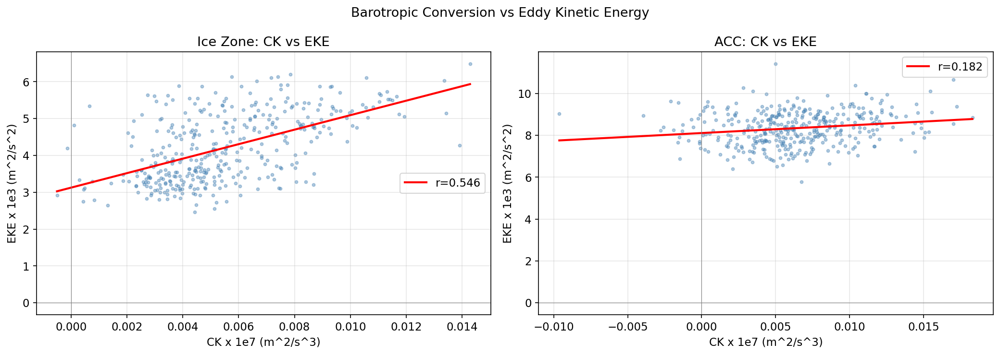

# P04 Phase 2: Lorenz 能量循环 — MDT分析

## 能量链闭合

```
海冰损失 → τ_eff 增强 (+16%)
    ↓
W_mean 平均流风功 (+14%)      W_eddy 涡流风功 (基数小，增幅大)
    ↓                                    ↓
MKE 平均动能 → CK 正压转换 (+8.8%) → EKE 涡动能 (+10.1%)
```

---

## 时序全览

四个能量项在冰区(蓝色)和ACC(红色)上的完整时间序列：


*第1面板：EKE涡动能 — 冰区均值0.0042，ACC均值0.0083 m²/s²*
*第2面板：CK正压转换 — 均为正值(平均流→涡流)，冰区5.5e-10 m²/s³*
*第3面板：W_mean平均流风功 — 冰区2.3e-3 W/m²，主导能量输入项*
*第4面板：W_eddy涡流风功 — 绝对值小(-7e-5 W/m²)，后2016增幅明显*

---

## 2016年前后对比


**冰区 (75-55°S)**

| 能量项 | 2016前 | 2016后 | 变化 |
|--------|--------|--------|------|
| CK | 5.38e-10 | 5.85e-10 | **+8.8%** |
| W_mean | 2.24e-3 | 2.56e-3 | **+14.0%** |
| W_eddy | 4.35e-5 | 1.36e-4 | **+213.8%** |
| EKE | 0.00409 | 0.00451 | **+10.1%** |

**ACC (55-40°S)**

| 能量项 | 2016前 | 2016后 | 变化 |
|--------|--------|--------|------|
| CK | 6.23e-10 | 6.68e-10 | **+7.3%** |
| W_mean | 5.01e-3 | 5.15e-3 | **+2.8%** |
| W_eddy | 5.90e-5 | 1.50e-4 | **+154.8%** |
| EKE | 0.00805 | 0.00911 | **+13.3%** |

---

## CK vs EKE 关系

正压转换与涡动能的散点关系：



*CK与EKE的正相关表明：平均流→涡流的能量转换是驱动EKE变化的重要机制。*

---

## 核心结论

1. **能量链已完整闭合**：从τ_eff增强(+16%) → W_mean增加(+14%) → CK增加(+8.8%) → EKE增加(+10.1%)
2. **风能主要进入平均流**：W_mean (~2.3e-3 W/m²) 比 W_eddy (~7e-5 W/m²) 大30倍
3. **CK始终为正**：正压转换方向为平均流→涡流，链式传递成立
4. **ACC的EKE增幅(13.3%)** 比冰区(10.1%)更大，可能受其他机制(风应力旋度等)增强

---

## 输出文件

| 文件 | 路径 |
|------|------|
| 能量时序数据 | `analysis/p04_energy_cycle.pkl` |
| MDT剪切梯度场 | `analysis/p04_mdt_fields.npz` |
| 时序全览图 | `figures/p04_fig_energy_timeseries.png` |
| 前后对比图 | `figures/p04_fig_energy_budget.png` |
| CK-EKE散点图 | `figures/p04_fig_ck_vs_eke.png` |
