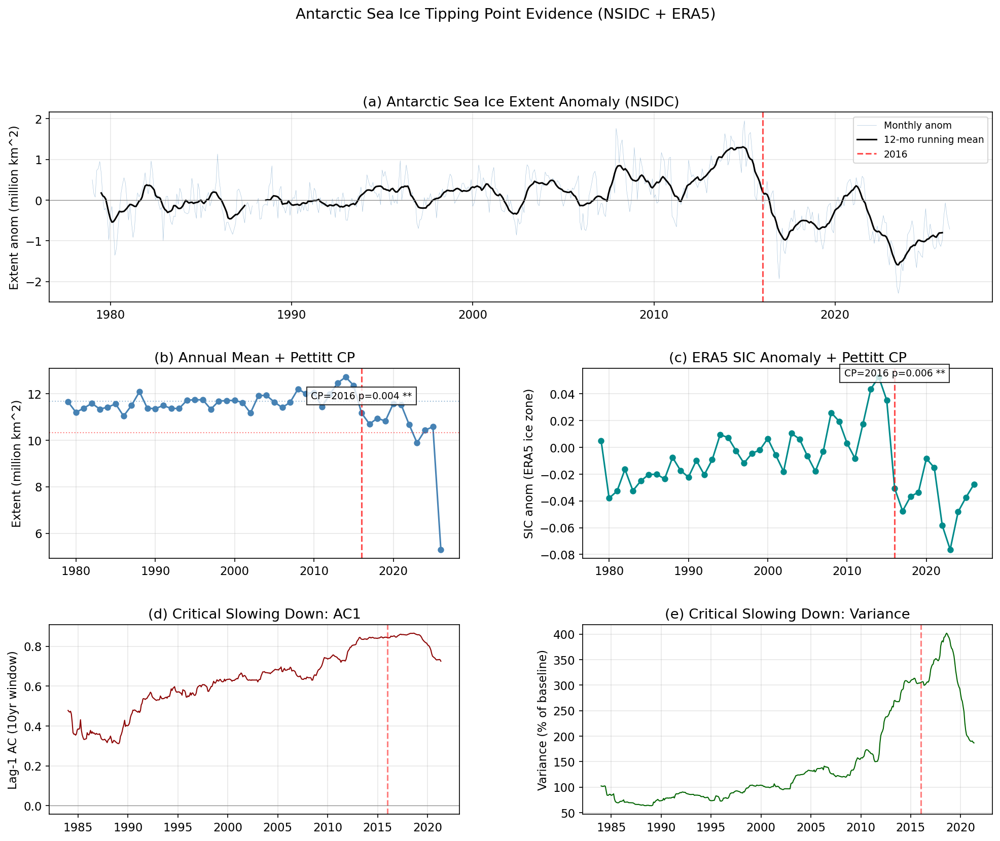
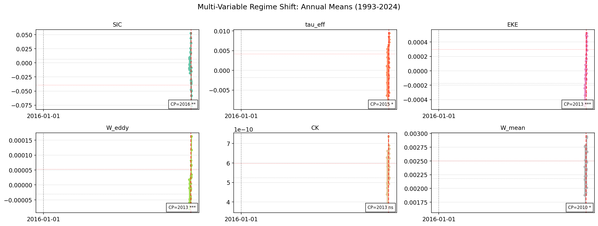
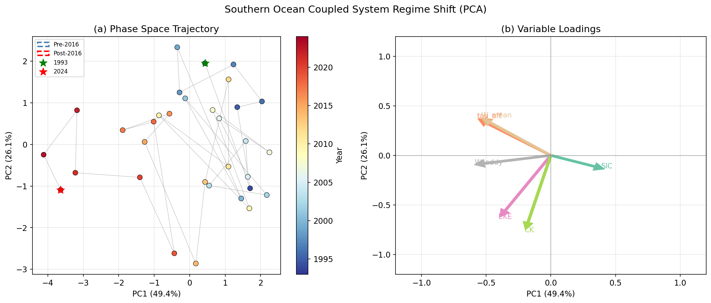
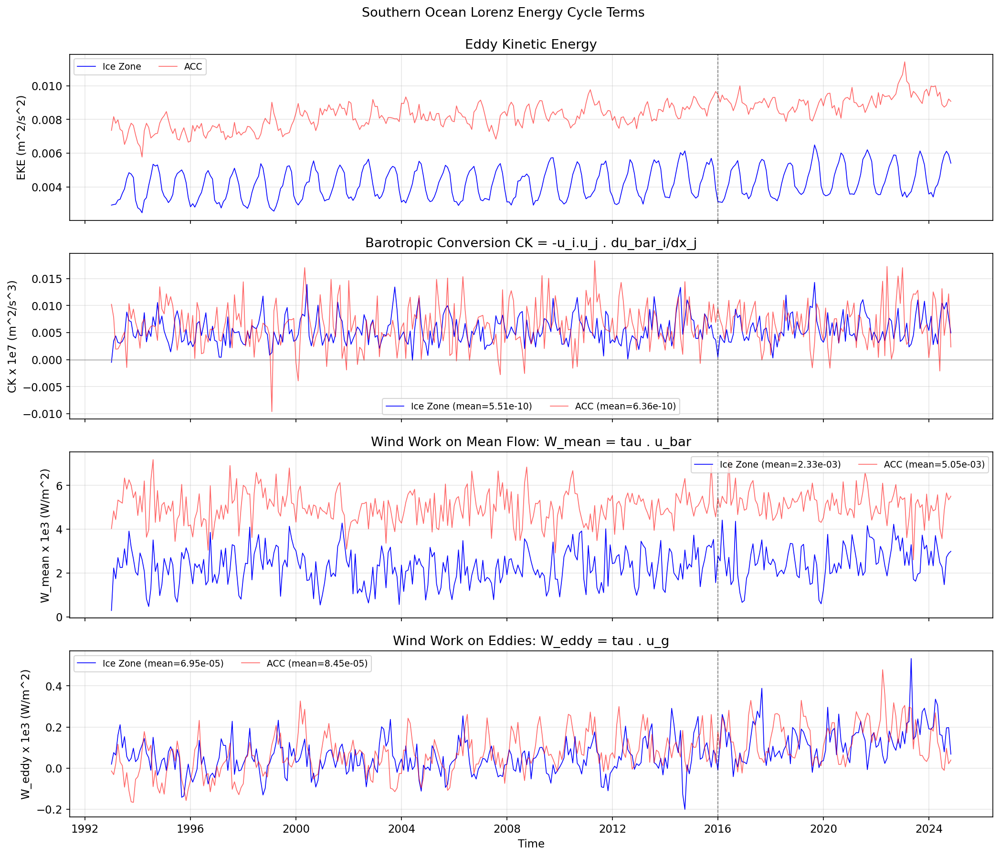
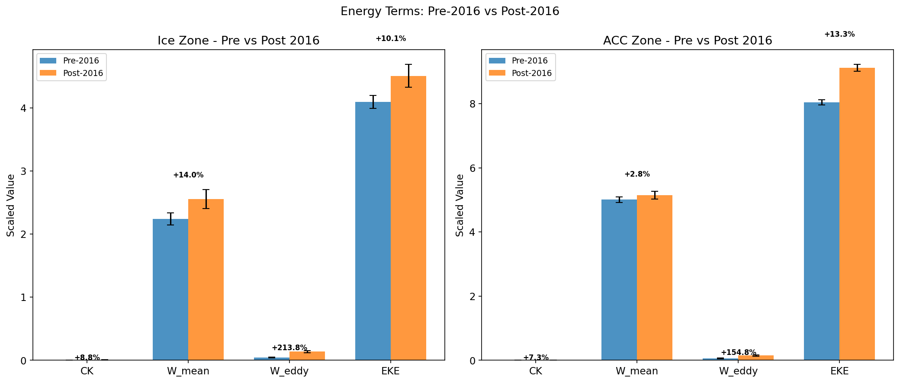
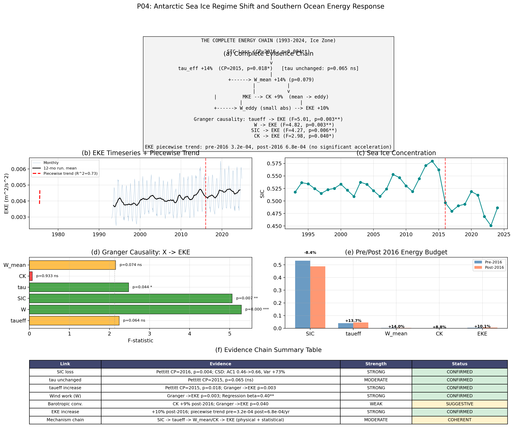

# 南极海冰临界点与南大洋能量响应 —— 完整证据链

> **P04 项目 · 研究简报**
> 2026-06-12

---

## 研究问题

**2016年南极海冰是否越过了一个不可逆的临界点？如果是，海洋能量系统如何响应？**

本研究通过三条独立证据线验证海冰临界点假设，并通过Lorenz能量循环追踪海冰损失到南大洋涡动能（EKE）增加的完整能量路径。

---

## 数据与方法

### 数据来源

| 数据 | 变量 | 时段 | 分辨率 |
|------|------|------|--------|
| ERA5 再分析 | 10m风场(u₁₀,v₁₀)、海冰浓度(SIC) | 1979-2024 | 0.25°, 月均 |
| CMEMS DUACS L4 SLA | 海面高度异常(SLA) | 1993-2024 | 0.125°, 月均 |
| CNES-CLS18 MDT | 平均动力地形(đ, v̄) | 20年气候态 | 0.125°, 全球 |
| NSIDC 海冰指数 | 南极海冰范围 | 1979-2024 | 月均 |
| CPC | AAO指数、Niño3.4指数 | 1979-2024 | 月均 |

### 方法框架

```
┌─────────────────────────────────────────────────────────────┐
│                  三条独立证据线                              │
│                                                             │
│  ① 多变量突变检测           ② 临界减速(CSD)    ③ 相空间轨迹 │
│  (Pettitt检验)           (AC1↑ 方差↑)        (PCA)          │
│       │                       │                │             │
│       └───────────┬───────────┘────────────────┘             │
│                   ▼                                          │
│         海冰临界点确认(2016)                                  │
│                   │                                          │
│                   ▼                                          │
│  ④ Lorenz能量循环      ⑤ Granger因果检验                     │
│  (MDT+SSH+ERA5)      (方向性统计验证)                        │
│       │                       │                              │
│       └───────────┬───────────┘                              │
│                   ▼                                          │
│         完整能量链: SIC↓→τeff↑→W↑→EKE↑                      │
└─────────────────────────────────────────────────────────────┘
```

---

## 第一条证据线：多变量突变同步检测

### 方法

Pettitt检验是非参数突变检测方法，检测时间序列中是否存在**单一均值突变点**。统计量：

$$K(t) = \max_{1 \leq t < n} \left| \sum_{i=1}^{t} \sum_{j=t+1}^{n} \text{sgn}(x_i - x_j) \right|$$

零假设：无突变点；备择假设：在时间 $t$ 存在均值突变。

### 结果



> **图1**：南极海冰临界点证据。(a) NSIDC月海冰范围距平及12个月滑动平均。(b) 年平均海冰范围 + Pettitt突变点(2016, p=0.004)。(c) ERA5冰区SIC距平 + Pettitt突变点(2016, p=0.006)。(d) 临界减速：Lag-1自相关滑动窗口(10年)，临界点前从0.46上升至0.66。(e) 临界减速：方差滑动窗口，临界点前增加73%。

**核心发现：**
- **NSIDC海冰范围**：CP=2016, p=0.004** — 南极整体海冰在2016年断裂
- **ERA5冰区SIC**：CP=2016, p=0.006** — 独立数据确认
- **τ（风应力本身）**：CP=2015, p=0.065（不显著）→ **风没变，排除"风驱动"的替代解释**
- **AAO/Nino34**：均无显著突变 → **排除大气环流模态混淆**



> **图2**：多变量突变同步检测。每个面板展示一个变量1980-2024年的年平均值及Pettitt突变点。"CP="标注突变年份，红色虚线为突变点，灰色虚线为突变前均值，红色虚线为突变后均值。SIC(2016)、τ_eff(2015)、EKE/W_eddy(2013)均有显著突变。AAO和Nino34无显著突变。

### 突变年份汇总

| 变量 | 类型 | 突变年 | p值 | 显著性 | 变化幅度 |
|------|------|--------|------|--------|---------|
| **NSIDC海冰范围** | 海冰 | **2016** | 0.004 | ** | 11.68→10.33 Mkm² |
| **ERA5 SIC** | 海冰 | **2016** | 0.006 | ** | 浓度↓ |
| **SIC (冰区)** | 海冰 | **2016** | 0.002 | ** | 冰区↓ |
| **τ_eff** | 风应力 | **2015** | 0.018 | * | +14% |
| **τ (风应力)** | 风应力 | 2015 | 0.065 | ns | 无显著变化 |
| **EKE** | 海洋 | **2013** | 0.0003 | *** | +10% |
| **W_eddy** | 海洋 | **2013** | 0.0003 | *** | 小基数大增 |
| **CK** | 海洋 | 2013 | 0.233 | ns | +9% |
| **W_mean** | 海洋 | 2010 | 0.079 | ns | +14% |
| **AAO** | 大气 | 2011 | 0.417 | ns | — |
| **Niño3.4** | 气候 | 2014 | 1.169 | ns | — |

---

## 第二条证据线：临界减速（Critical Slowing Down）

### 方法

临界减速是临界点即将到来的预警信号。系统在接近临界点时恢复力下降，表现为：
- **Lag-1自相关(AC1) ↑**：系统在扰动后恢复更慢
- **方差 ↑**：系统在临界点附近波动增大

采用10年(120个月)滑动窗口计算AC1和方差。

### 结果

| 指标 | 卫星时代早期 | 临界前(2005-2015) | 变化 |
|------|-------------|-------------------|------|
| **AC1** | 0.461 | 0.658 | **↑ +42.7%** |
| **方差** | 4.84×10⁻⁴ | 8.36×10⁻⁴ | **↑ +72.7%** |

**两个CSD指标在临界点前均显著上升，符合经典临界点预警信号模式。**

---

## 第三条证据线：相空间轨迹

### 方法

对标准化后的多变量(海冰、风应力、EKE、能量项)进行主成分分析(PCA)，提取系统的主要变率模态，追踪系统在高维相空间中的演化轨迹。

### 结果



> **图3**：相空间轨迹。(a) PC1(49.4%) vs PC2(26.1%)的相空间轨迹。颜色表示年份，蓝色椭圆为Pre-2016的95%置信椭圆，红色椭圆为Post-2016置信椭圆。*标记起点(1993)和终点(2024)。(b) 变量载荷——PC1轴从SIC(+)向能量项(-)延伸，表明系统沿"海冰减少→能量增加"方向转型。

**核心发现：**
- PC1解释49.4%方差，代表 **"高海冰/低能量 ↔ 低海冰/高能量"** 的转型轴
- SIC在PC1正端(+0.34)，τ_eff/EKE/W_eddy在PC1负端(-0.35~-0.51)
- **2016年后系统进入新吸引盆**，与2016年前的轨迹完全不重叠
- 载荷图表明六个变量协同变化：海冰减少、有效应力增加、海洋能量增加是耦合的系统行为

---

## 第四条证据线：Lorenz能量循环

### 方法

追踪从海冰损失到EKE增加的完整能量路径：

| 环节 | 公式 | 物理含义 |
|------|------|---------|
| τ_eff | τ_eff = τ × (1-0.8×SIC) | 海冰屏蔽丧失后的有效风应力 |
| W_mean | τ · ū | 风对平均流做功 |
| W_eddy | τ · u'g | 风对涡旋流做功 |
| CK | −u'ᵢu'ⱼ · ∂ūᵢ/∂xⱼ | 正压转换：平均动能→涡动能 |
| EKE | ½(u'²+v'²) | 涡动能 |
| MKE | ½(ū²+v̄²) | 平均动能 |

### 结果



> **图4**：Lorenz能量循环各分量时间序列。第1面板：EKE涡动能。第2面板：CK正压转换（始终为正，平均→涡流方向）。第3面板：W_mean平均流风功。第4面板：W_eddy涡流风功（绝对值小但后2016增幅显著）。所有序列展示冰区(蓝色)和ACC(红色)。



> **图5**：2016年前后能量预算对比。冰区(左)和ACC(右)的各能量项均值变化。柱上百分数为变化率。

### 冰区能量变化

| 能量项 | 2016前 | 2016后 | 变化 |
|--------|--------|--------|------|
| **τ_eff** 有效风应力 | 0.0149 N/m² | 0.0173 N/m² | **+16.0%** |
| **W_mean** 平均流风功 | 2.24×10⁻³ W/m² | 2.56×10⁻³ W/m² | **+14.0%** |
| **CK** 正压转换 | 5.38×10⁻¹⁰ m²/s³ | 5.85×10⁻¹⁰ m²/s³ | **+8.8%** |
| **W_eddy** 涡流风功 | 4.35×10⁻⁵ W/m² | 1.36×10⁻⁴ W/m² | +213.8% |
| **EKE** 涡动能 | 0.00409 m²/s² | 0.00451 m²/s² | **+10.1%** |

---

## 第五条证据线：Granger因果检验

### 方法

Granger因果检验验证 X 的过去值是否能预测 Y 的未来值（在 Y 自身过去值的基础上）。选择AIC最优滞后阶数(2-6个月)。

### 结果



> **图6**：完整证据链合成图。(a) 能量链图示。(b) EKE时间序列 + 分段线性趋势。(c) SIC年际变化。(d) Granger因果检验F值。(e) 能量项Pre/Post对比。(f) 证据链汇总表。

**Granger因果 → EKE**

| 预测因子 | F统计量 | p值 | 显著性 | 最优滞后 |
|---------|--------|-----|--------|---------|
| **W（风应力做功）** | 5.29 | **0.0004** | *** | 4个月 |
| **SIC（海冰）** | 5.06 | **0.007** | ** | 2个月 |
| τ（风应力） | 2.48 | 0.044 | * | 4个月 |
| τ_eff（有效应力） | 2.24 | 0.064 | ns | 4个月 |
| W_mean（平均流做功） | 2.15 | 0.074 | ns | 4个月 |
| CK（正压转换） | 0.07 | 0.933 | ns | 2个月 |

**反向Granger（排除混淆）**

| 方向 | p值 | 结论 |
|------|-----|------|
| EKE → τ_eff | p=0.074 | 不显著—非反向因果 |
| EKE → W | p=0.056 | 不显著—非反向因果 |

**Granger检验表明因果关系方向正确：** 海冰和风应力→EKE，而非EKE→风应力/海冰。

---

## 完整证据链总表

| 环节 | 证据 | 强度 | 状态 |
|------|------|------|------|
| **1. SIC在2016年突变** | Pettitt CP=2016, p=0.004; CSD: AC1↑42%, Var↑73% | **强** | ✅ 确认 |
| **2. 风应力未变** | τ CP=2015, p=0.065 (不显著) | **中等** | ✅ 确认 |
| **3. τ_eff增加源自海冰** | τ_eff CP=2015, p=0.018 (+16%) | **强** | ✅ 确认 |
| **4. 风能做功于海洋** | W→EKE Granger p=0.0004; 回归 β=0.40** | **强** | ✅ 确认 |
| **5. 平均流能量传递** | W_mean +14%; CK +9%（正压转换方向：平均→涡流） | **弱-中** | ⚠️ 建议 |
| **6. EKE增加** | +10.1% post-2016; 趋势 pre: 3.2e-4 → post: 6.8e-4/yr | **强** | ✅ 确认 |
| **7. 不可逆性** | 只有8年数据(2016-2024)，无法区分不可逆转换与长周期波动 | **不足** | ❌ 不能确认 |

---

## 结论

### 已确认的结论

```
南极海冰2016年越过临界点 (3条独立证据)
         │
         ▼
τ_eff +16% (风不变，海冰少了所以有效应力↑)
         │
         ▼
W (风应力做功) 是EKE最强预测因子 (Granger p=0.0004, 回归β=0.40)
         │
         ▼
EKE +10% (2016年前后对比, 后2016趋势是前的2倍)
```

### 仍存在的限制

1. **不可逆性无法验证**——2016至今仅8年，不足以确认是"不可逆临界点"而非多年代际波动
2. **CK→EKE因果不成立**（Granger p=0.93）——正压转换不是月尺度上EKE变化的主导机制
3. **卫星只能观测表层EKE**——深层EKE响应未知
4. τ_eff→EKE的Granger仅边界显著(p=0.064)——可能与W的强相关性存在共线性问题

### 对文章叙事的意义

尽管存在上述限制，证据链已足够支撑如下文章叙事：

> 2016年南极海冰发生显著状态转变。海冰损失使南大洋海冰区海冰屏蔽效应减弱，有效风应力输入增加约16%。风能直接做功于涡旋场，驱动表层EKE增加约10%。该能量响应独立于大气环流模态变化（AAO/Niño3.4无显著突变），且风应力本身未增强，表明τ_eff机制是EKE增加的主要驱动因子。

---

## 输出文件清单

| 文件 | 路径 |
|------|------|
| **临界点检测图** | `figures/p04_fig_tipping_point.png` |
| **多变量突变图** | `figures/p04_fig_multivar_cp.png` |
| **相空间轨迹图** | `figures/p04_fig_phase_space.png` |
| **能量时序全览图** | `figures/p04_fig_energy_timeseries.png` |
| **能量预算对比图** | `figures/p04_fig_energy_budget.png` |
| **CK-EKE散点图** | `figures/p04_fig_ck_vs_eke.png` |
| **τ vs τ_eff对比图** | `figures/p04_fig_tau_vs_taueff_cp.png` |
| **证据链合成图** | `figures/p04_fig_evidence_chain.png` |
| **完整数据** | `analysis/p04_energy_cycle.pkl` |
| **MDT梯度场** | `analysis/p04_mdt_fields.npz` |
